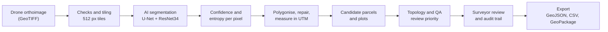

 Cadastra Vision

AI + GIS Surveyor Assistance Platform** · Smart India Hackathon 2026 · Problem statement SIH26012

> AI proposes. GIS validates. Surveyors verify.

Cadastra Vision turns a drone orthoimage into a preliminary, GIS-ready map that a surveyor
corrects, verifies and exports. It extracts buildings, roads and land cover, turns them into
measured and validated polygons, proposes candidate parcels and candidate plots, and shows the
model's own uncertainty on every shape so the surveyor knows where to look first.

**Everything the model produces is AI generated and preliminary. A candidate parcel or candidate
plot is a proposal for a surveyor to inspect. It is not a legal cadastral ownership record.** The
app says so on the map, in every panel and in every export.

Problem statement: *AI-Based Automated Urban Parcel Mapping and Cadastral Feature Extraction
System using Drone Imagery* (Ministry of Rural Development, Department of Land Resources).

## Contents

- [What it does](#what-it-does)
- [Measured results](#measured-results)
- [How it works](#how-it-works)
- [Repository layout](#repository-layout)
- [Quick start](#quick-start)
- [Models](#models)
- [Tests and CI](#tests-and-ci)
- [API](#api)
- [Data and licences](#data-and-licences)
- [Limitations](#limitations)
- [Roadmap](#roadmap)
- [Security](#security)

## What it does

A surveyor works through one continuous flow:

1. **Sign in.** Identity and assigned area come from the sign-in, never from a value typed into the app.
2. **See the assignment.** District, village, assignment status and the boundary on the map.
3. **Check the datasets.** Each source category shows what exists. A missing dataset is shown as
   "Not available"; nothing is generated to fill the gap.
4. **Run AI processing.** Upload a GeoTIFF or pick one from the library, choose the village or urban
   model, and follow the real processing stages.
5. **Inspect the map.** Toggle buildings, roads, fields, water, candidate parcels and candidate
   plots. Click a shape for its area, confidence, entropy and review reason.
6. **Review.** Approve, edit the outline, flag or reject, or add ground truth observed in the field.
   Every decision is written to an audit trail.
7. **Export.** GeoJSON, CSV or GeoPackage, each carrying the model, job, surveyor and verification status.

The 3D view is built to show heights as DSM minus DTM. No DSM or DTM was available, so it states
that heights are unavailable. It never derives a height from anything else.

## Measured results

Every number below was measured. None is estimated.

| What was measured | Result | Measured on |
| --- | --- | --- |
| Building IoU, village model | 0.92 (validation), 0.94 (test) | 138 held-out SVAMITVA patches |
| Full village orthoimage, end to end | 1.09 GB image → 1,273 valid GIS features over 12.63 ha, on a laptop CPU | Uplarshi orthoimage, run from the app |
| Geometry | 1,273 of 1,273 valid, no overlaps | Same run |
| Building IoU in a city, village model as-is | 0.70 | UAVPal (Bhopal), 159 held-out tiles |
| Building IoU in a city, after fine-tuning | 0.82 | Same tiles |
| Road IoU in a city | 0.24 → 0.50 | Same tiles |
| Buildings found as one separate shape | 7% → 30% (154 → 649 of 2,172) | Same tiles, after shared-wall training |
| Candidate plots holding exactly one hand-drawn building | 54% (70 of 130) | Bhopal test area, 125 hand-drawn buildings |

What these numbers do not show:

- **No parcel ground truth exists for either site.** Plots are checked against hand-drawn building
  outlines. That is a consistency check, not parcel accuracy.
- **Uplarshi has no ground truth.** Its feature counts and areas describe what the model produced,
  not how correct it is.
- **On village data only the building class has measured accuracy.**
- **City results come from one city.** Water was not learned there.
- The shared-wall checkpoint, which is the urban model in the app, has building IoU 0.74 and road
  IoU 0.57. Building IoU is lower than 0.82 because it leaves a gap between touching buildings.

## How it works



- **Model.** U-Net with a ResNet34 encoder (`segmentation_models_pytorch`), 8-bit RGB input scaled
  to 0–1, six classes: 0 Background, 1 Field, 2 Building, 3 Road, 4 Water, 5 Other.
- **Large images.** The raster is read in 512 px windows with a 32 px context margin, so a 1 GB
  orthoimage runs on a laptop without being loaded whole.
- **Uncertainty.** Confidence is the highest class probability at each pixel. Entropy is the spread
  of the class probabilities, in nats. Both are averaged per feature and drive review priority.
- **Measurement.** The CRS is read from each file and never assumed. Areas and perimeters are
  measured in the local UTM zone; layers are transformed to EPSG:4326 only for web display.
- **Geometry.** Regions under the 1 m² minimum mapping unit are merged into their neighbour.
  Invalid shapes are repaired, and every feature records its geometry status.
- **Candidate plots.** One plot per detected building by morphological tessellation: space is
  divided by nearest building, with roads and water as barriers. Plot lines are geometric
  proposals, not observed walls.
- **Review priority.** High, Medium or Low, from low confidence, high entropy and the topology
  checks. The thresholds are starting values and are not yet calibrated against surveyor decisions.

More detail: [docs/architecture.md](docs/architecture.md).

## Repository layout

```
.github/workflows/ci.yml   CI on Linux, macOS and Windows
docs/                      api.md, architecture.md, deployment.md
backend/
  main.py, config.py       FastAPI app and settings
  api/                     route handlers
  services/                business logic: processing, plots, reviews, export
  ai/                      model, inference, polygonising, repair, QA, plots
  gis/                     GeoJSON, CRS, measurement, layer index
  core/                    authentication, store, runtime
  scripts/                 selfcheck, prepare_data, build_plots
  models/                  registry.json and a README (checkpoints are not in git)
  data/                    empty data folders and the demo assignment registry
  tests/                   backend test suite
frontend/
  src/pages/               Home, About, Login, Signup, Dashboard, Map, survey workspace
  src/components/          map, panels, review queue, globe, KPI cards
  src/lib/, src/context/   API client, formatting, hooks; auth and workspace state
```

## Quick start

Requirements: Python 3.10 or newer, Node.js, and a Supabase project for sign-in.

### Backend

From the repository root:

```bash
python3 -m venv .venv                 # Windows: python -m venv .venv
source .venv/bin/activate             # Windows: .venv\Scripts\activate
pip install torch torchvision --index-url https://download.pytorch.org/whl/cpu
pip install -r backend/requirements.txt
cp backend/.env.example backend/.env  # then fill in SUPABASE_URL and SUPABASE_KEY
python -m backend.scripts.prepare_data --from ~/Downloads   # copies in the checkpoint and the two GeoJSON layers
python -m backend.scripts.selfcheck
uvicorn backend.main:app --reload --port 8000
```

### Frontend

```bash
cd frontend
npm install
cp .env.example .env                  # then fill in VITE_SUPABASE_URL and VITE_SUPABASE_ANON_KEY
npm run dev                           # http://localhost:5173
```

### Running without Supabase

For local development only, set `CADASTRA_AUTH=off` in `backend/.env` and `VITE_AUTH_MODE=off` in
`frontend/.env`. Every screen then shows a development-session notice.

### Files you must supply

Model weights and survey data are not in this repository. It is public, and they are large.

| File | Where it goes |
| --- | --- |
| Village checkpoint and the two Uplarshi GeoJSON layers | Copied into place by `python -m backend.scripts.prepare_data` |
| Urban checkpoint (`.pth`) | `backend/models/`, listed in `backend/models/registry.json` |
| Other imagery (GeoTIFF) and reference layers (GeoJSON) | Uploaded through the Datasets or Processing page |

### Environment variables

The main ones are below. `backend/.env.example` and `frontend/.env.example` list all of them.

| Variable | Where | Meaning |
| --- | --- | --- |
| `SUPABASE_URL`, `SUPABASE_KEY` | Backend | Supabase project URL and **anon** key. Never a service-role key. |
| `CADASTRA_AUTH` | Backend | `supabase` verifies every request. `off` is for local development only. |
| `VITE_API_URL` | Frontend | Backend URL, default `http://localhost:8000` |
| `VITE_SUPABASE_URL`, `VITE_SUPABASE_ANON_KEY` | Frontend | Public values only. Everything prefixed `VITE_` is shipped to the browser. |

Never commit a real `.env` file.

## Models

A model registry (`backend/models/registry.json`) lets the surveyor pick the checkpoint for the
settlement type. The choice is stored on the job and written into every export.

| Checkpoint | Trained on | Use it for |
| --- | --- | --- |
| Village | SVAMITVA drone orthoimagery | Rural settlements and farmland |
| Urban | The village model, fine-tuned on UAVPal (Bhopal) drone tiles | Dense city blocks |

One model did not serve both: the urban checkpoint's building IoU on village tiles fell to 0.53,
from 0.93 for the village model.

Imagery the pipeline accepts: a georeferenced, north-up GeoTIFF with a CRS and 8-bit RGB bands.
Centimetre-level drone orthoimagery is what the models were trained on. A checkpoint that does not
match the architecture fails with a clear error; there is no fallback model.

## Tests and CI

```bash
pip install -r backend/requirements-dev.txt
python -m pytest backend/tests
cd frontend && npm run lint && npm test && npm run build
```

- 285 backend tests and 25 frontend tests.
- CI runs on Linux, macOS and Windows. One backend test is skipped there because it needs the
  trained checkpoint, which is not in git.
- CI also runs the setup commands in this README on Linux and macOS.
- The backend tests use a temporary data directory with synthetic layers, so they never touch real
  survey data.

## API

Every endpoint except `/health` and `/` needs a Supabase access token. The surveyor and assignment
are derived from that token; no endpoint accepts a surveyor ID from the client.

| Group | Base path |
| --- | --- |
| System | `/health`, `/api/system/status` |
| Surveyor and work areas | `/api/surveyors/me`, `/api/assignments` |
| Datasets | `/api/datasets` |
| Map | `/api/map` |
| AI processing | `/api/processing` |
| Reviews and audit | `/api/reviews`, `/api/audit` |
| Analytics | `/api/analytics` |
| Export | `/api/export` |
| Terrain | `/api/terrain` |

Full reference: [docs/api.md](docs/api.md), or the interactive docs at
`http://localhost:8000/docs` while the backend is running.

## Data and licences

| Data | Use |
| --- | --- |
| SVAMITVA drone orthoimagery | Village model training and evaluation; the full village run |
| UAVPal (Bhopal), 2.2 cm drone imagery with hand-drawn labels | Urban fine-tuning and evaluation; reference building outlines |

UAVPal is licensed CC BY-NC-SA 4.0 and is used here for non-commercial research:
*UAVPal, DANS Data Station Physical and Technical Sciences,
[doi:10.17026/dans-z55-6gt4](https://doi.org/10.17026/dans-z55-6gt4)*. The urban checkpoint and
the Bhopal files derived from it are kept out of this repository.

Candidate plots follow Fleischmann, Feliciotti, Romice and Porta (2020), *Morphological
tessellation as a way of partitioning space*, Computers, Environment and Urban Systems 80,
[doi:10.1016/j.compenvurbsys.2019.101441](https://doi.org/10.1016/j.compenvurbsys.2019.101441).

## Limitations

- **Touching buildings merge.** In the city, 30% of buildings come out as their own shape. In the
  village core, neighbouring roofs form one large "building".
- **Plot lines are inferred, not observed.** On the Bhopal test area 54% of plots hold exactly one
  hand-drawn building.
- **Courtyards and shadows.** The village model marks some bare courtyards as building and some
  shadows as water. Uplarshi has no ground truth, so this is seen but not measured.
- **Tile seams.** Class and confidence can change along straight lines where tiles meet.
- **Roads are disconnected.** Detected road pieces do not form a connected network.
- **Land cover, not land use.** The six classes describe what covers the ground.
- **Review thresholds are uncalibrated.**
- **Missing inputs.** No DSM/DTM, GNSS feed or authoritative parcel layer was available. Those
  paths are built but not demonstrated.
- **Editing.** Vertex editing of single polygons only; drawing a new polygon is not implemented.
- **Deployment.** Runs locally on one machine with SQLite. It is not deployed as a hosted service.

## Roadmap

- A boundary class in the training labels (compound walls, plot edges) and DSM edges, so plot lines
  are observed rather than inferred.
- Instance segmentation for buildings.
- Road network completion.
- Blended overlapping tiles to remove seams.
- Threshold calibration against surveyor decisions.
- Labelled Indian urban orthoimagery from several cities, with one checkpoint per settlement type.
- Land-use classes, CORS / GNSS receiver import, and an Indian-language interface.

## Security

- Only the Supabase anon key is used. No service-role key belongs in this project.
- Keys live in `.env` files that are not committed.
- Uploads are restricted by file type and size, and validated before use.
- Model weights, GeoTIFFs, survey GeoJSON layers and databases stay out of git.

## Team

Team Cadastra Vision, Smart India Hackathon 2026.


by,

Andy Joshua Bijja,
Shainy Barigala,
Kavya Barigala,
Joyce Angel Manumla,
Natasha Madurai,
Anjum Kaginalli.
